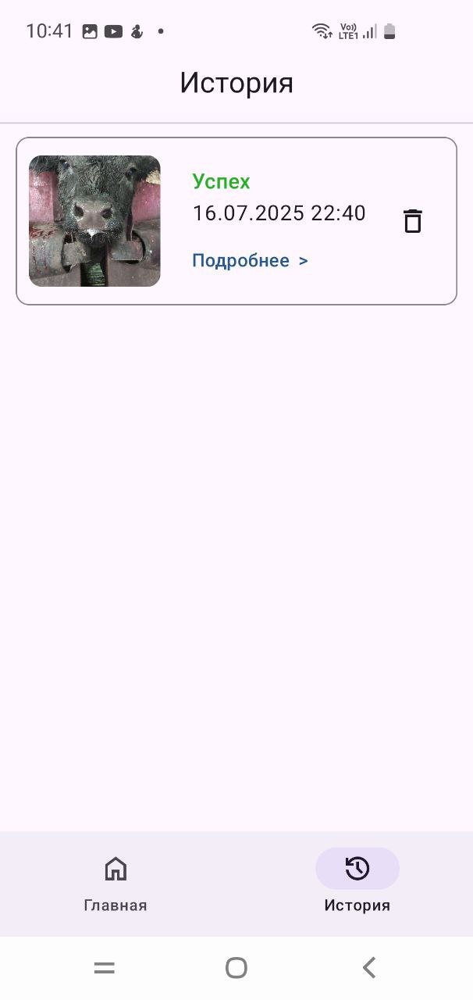
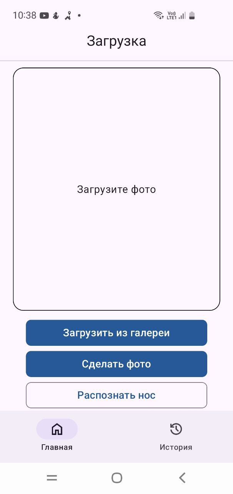
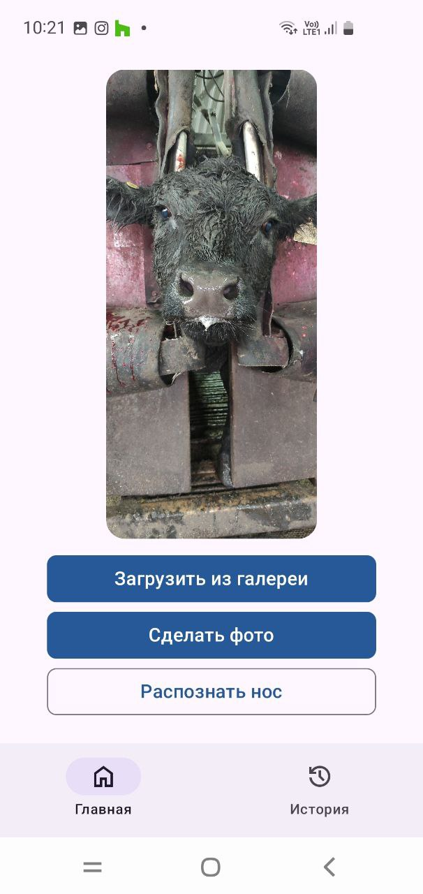
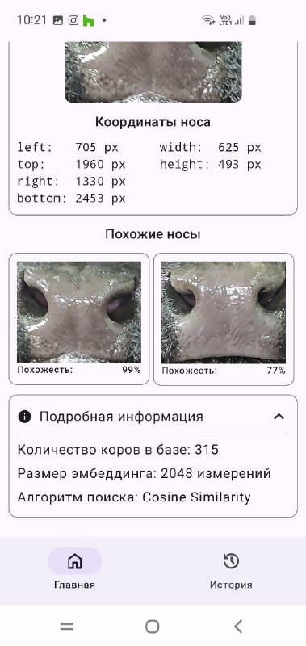
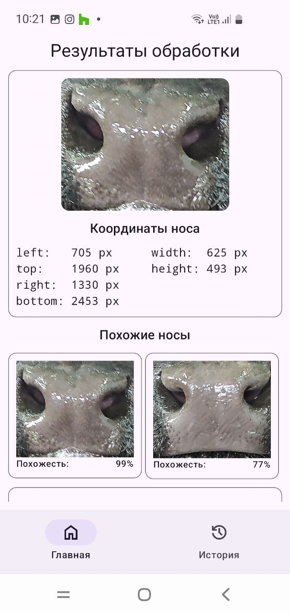
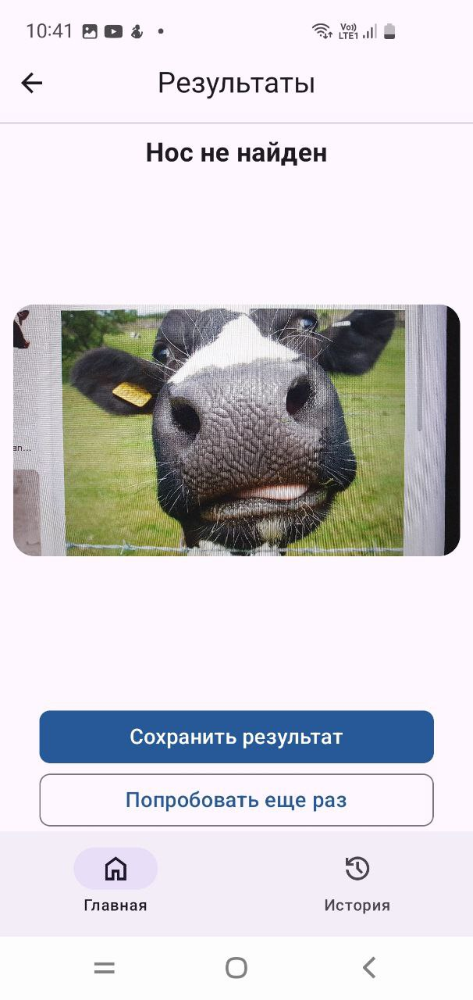

# Разработка мобильного приложения для идентификации крупного рогатного скота по фотографии носа для операционной системы Андроид на языке Котлин

Приложение сделано в рамках обучения на ЦК 2025

## Скриншоты

  
  
  
  
  
  

## Технологии

### Мобильное приложение (Android)
- Язык: Kotlin
- Минимальная версия Android: 9
- Используемые библиотеки:
  - Ktor
  - kotlinx.serialization
  - Jetpack Compose
  - Koin
  - Room

### Бэкенд
- Язык: Python
- Фреймворк: FastAPI
- Документация бэкенда: http://158.255.0.109:5353/docs
